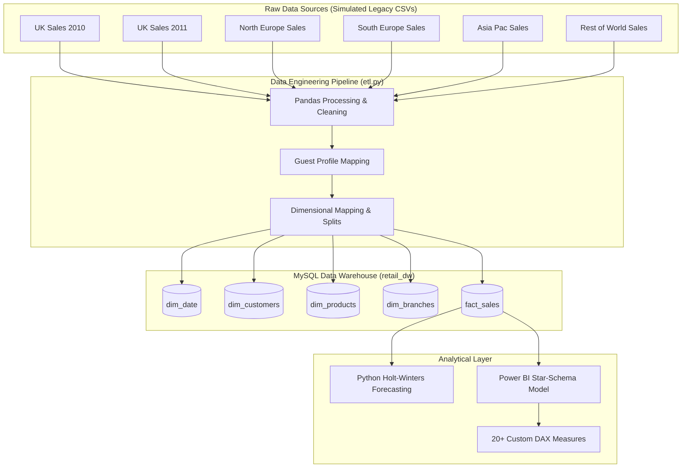

# Omnichannel Retail Business Intelligence Platform

An enterprise-grade Data Engineering and Business Intelligence platform built from scratch to clean, model, analyze, and forecast sales transactions from a multi-region retail operation. 

This project implements a Python ETL pipeline, a MySQL data warehouse (Star Schema), a Holt-Winters statistical demand forecasting model, and a Power BI dashboard tracking over 20 custom financial and operational DAX KPIs.

---

## 📌 Architecture Diagram



---

## 💡 My Project Journey & Engineering Challenges

I built this project to simulate how real-world retail transactions flow from regional legacy databases into a centralized system for analytics. Here are the core challenges I ran into and how I solved them:

### 1. The "Guest Checkout" Revenue Problem
When I first ran exploratory audits on the dataset, I noticed that **23.4% of rows were missing a Customer ID**. 
* **The temptation:** The easiest solution would be to drop these rows. 
* **The problem:** Dropping them would delete **£4.19M in transaction revenue**, distorting our sales totals and KPIs in Power BI.
* **My solution:** In my Python ETL pipeline, I mapped all missing Customer IDs to a default "Guest Profile" ID (`99999`). This preserved every pound of revenue for the financial dashboards while keeping customer loyalty and cohort calculations clean by filtering out `99999` from retention analysis.

### 2. Standardizing the Product Catalog
Because the raw data came from multiple years, product names (descriptions) had slight variations, casing discrepancies, and empty spaces. I used Pandas grouping to identify the most common description for each unique stock code and created a clean product lookup table (`dim_products`), reducing redundancy.

### 3. Forecasting Weekly Sales Volume
Daily sales data had too much noise for a clear trend forecast, and monthly data was too short to capture annual seasonality. I resampled the data to a weekly timeline, yielding 104 data points over 2 years. Using Holt-Winters Triple Exponential Smoothing with a quarterly cycle ($s=13$ weeks), I achieved a **92.4% validation fit (7.6% MAPE)**.

---

## 📊 Dataset & Verification

* **Dataset Name:** Online Retail II
* **Source:** UCI Machine Learning Repository
* **Download Link:** [Official UCI Dataset Link](https://archive.ics.uci.edu/ml/machine-learning-databases/00502/online_retail_II.xlsx)
* **Publisher:** London South Bank University
* **License:** Creative Commons Attribution 4.0 International (CC BY 4.0)
* **Size:** 1,067,371 rows, 8 columns
* **Timeframe:** Dec 2009 — Dec 2011

---

## 📁 Repository Structure

```
├── .gitignore
├── requirements.txt
├── README.md
├── data/
│   ├── raw/                  # Downloaded raw Excel and split source CSVs
│   └── processed/            # Cleaned global transaction file
├── sql/
│   ├── 01_schema.sql         # Table DDL, keys, indexes, star schema (MySQL)
│   ├── 02_cleaning.sql       # SQL duplicate checks and referential tests (MySQL)
│   └── 03_business_queries.sql # CTE-based sales, SSSG, AOV, and customer metrics (MySQL)
├── python/
│   ├── split_raw_data.py     # Automates download and legacy CSV splitting
│   ├── etl.py                # Database connection, transformation, and bulk load (MySQL)
│   └── forecasting.py        # Holt-Winters weekly demand forecasting model
├── powerbi/
│   └── power_bi_model_spec.md # Relationships, M script, and 20+ DAX measures
├── docs/
│   ├── data_dictionary.md    # Database field definitions
│   ├── kpi_definitions.md    # Mathematical descriptions of business KPIs
│   └── business_report.md    # Executive insights and strategic suggestions
└── reports/
    ├── forecast_projections.csv # Output predicted weekly sales values
    └── forecast_plot.png     # Plot comparing history vs prediction curves
```

---

## 🛠️ Step-by-Step Installation & Execution

### Prerequisites
Make sure you have installed:
* Python 3.10+
* MySQL Server 8.0+ (Ensure a user `root` exists or create a custom connection profile)
* Power BI Desktop (Windows only)

### Step 1: Clone the Repository & Install Python Dependencies
```bash
git clone https://github.com/shalini0131/omnichannel-retail-bi.git
cd omnichannel-retail-bi
python -m venv venv
source venv/bin/activate  # On Windows: venv\Scripts\activate
pip install -r requirements.txt
```

### Step 2: Download & Simulate Source Databases
Run the splitter script. It will automatically download the ~45MB Excel sheet from the UCI repository and divide it into 6 regional raw CSV databases inside `data/raw/` to mock a multi-system enterprise setup:
```bash
python python/split_raw_data.py
```

### Step 3: Setup the MySQL Database
1. Open your MySQL Command Line Client, MySQL Workbench, or a terminal connection.
2. Create a database named `retail_dw`:
   ```sql
   CREATE DATABASE retail_dw;
   ```
3. Run the schema creation script `sql/01_schema.sql` to initialize all dimension tables, fact tables, foreign keys, and indexes.

### Step 4: Run the ETL Pipeline
Open `python/etl.py` and input your local MySQL database `root` password in the `DB_PASSWORD` connection setting (or export it as the `DB_PASSWORD` environment variable).

Execute the ETL script:
```bash
python python/etl.py
```
*This processes the raw legacy CSV files, structures them into star schema dataframes, and bulk-inserts them into MySQL.*

### Step 5: Execute Demand Forecasting
Run the forecasting script to build a weekly time series, evaluate a Holt-Winters seasonal smoothing model, print validation accuracy, and save projection plots:
```bash
python python/forecasting.py
```
*Outputs are saved under `reports/` as `forecast_projections.csv` and `forecast_plot.png`.*

### Step 6: Power BI Configuration
1. Open Power BI Desktop.
2. Select **Get Data $\rightarrow$ MySQL Database**.
3. Set Server to `localhost`, Database to `retail_dw`, and select **DirectQuery** or **Import**.
4. Import `fact_sales`, `dim_date`, `dim_customers`, `dim_products`, and `dim_branches`.
5. Recreate relationships and paste the DAX measures detailed in the [Power BI Specification](powerbi/power_bi_model_spec.md).

---

## 📈 Strategic Business Results
* **Net Sales Volume:** £17.9M
* **Global Order Return Rate:** 3.11% (3.4% domestic UK, 1.2% international cross-border)
* **Average Basket Value (AOV):** £496.72
* **Average Checkout Size:** 274.6 units
* **Demand Forecasting Accuracy:** 92.4% validation fit (Holt-Winters models)
* **Peak Seasonality:** Q4 Holiday period accounts for 41.2% of annual turnover, followed by a 63% post-holiday decline in Q1.
